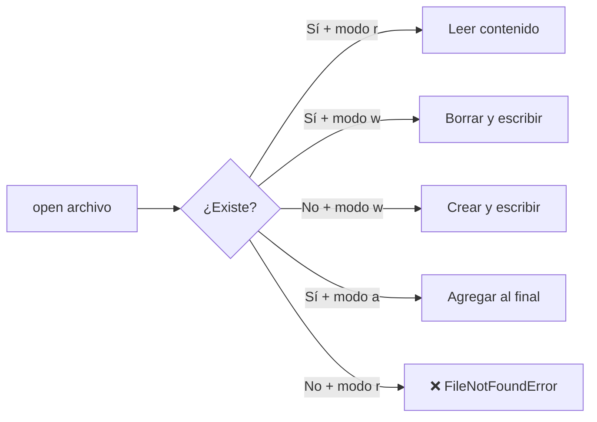

# 📁 Manejo de Archivos en Python

> Cómo leer, escribir y manipular archivos desde Python. Sin complicaciones.

---

## 📋 Índice

1. [¿Para qué manejar archivos?](#1-para-qué-manejar-archivos)
2. [Abrir un archivo con `open()`](#2-abrir-un-archivo-con-open)
3. [Modos de apertura](#3-modos-de-apertura)
4. [El bloque `with` — la forma recomendada](#4-el-bloque-with--la-forma-recomendada)
5. [Leer un archivo](#5-leer-un-archivo)
6. [Escribir en un archivo](#6-escribir-en-un-archivo)
7. [Agregar contenido sin borrar lo anterior](#7-agregar-contenido-sin-borrar-lo-anterior)
8. [Trabajar con rutas](#8-trabajar-con-rutas)
9. [Archivos CSV](#9-archivos-csv)
10. [Errores comunes](#10-errores-comunes)
11. [Resumen rápido](#11-resumen-rápido)

---

## 1. ¿Para qué manejar archivos?

Guardar datos en variables solo dura mientras el programa corre. Si querés que la información **persista entre ejecuciones**, necesitás archivos.

Casos comunes:
- Guardar resultados o reportes en `.txt`
- Leer configuraciones
- Importar o exportar datos en `.csv`
- Registrar eventos en logs

---

## 2. Abrir un archivo con `open()`

```python
archivo = open("datos.txt", "r")   # abre para leer
contenido = archivo.read()
archivo.close()                    # siempre cerrar
```

> ⚠️ Si olvidás llamar a `.close()`, el archivo puede quedar bloqueado. Por eso existe `with`.

---

## 3. Modos de apertura

| Modo | Descripción |
|------|-------------|
| `"r"` | Leer (**read**). El archivo debe existir. |
| `"w"` | Escribir (**write**). Crea el archivo o **borra** su contenido si ya existe. |
| `"a"` | Agregar (**append**). Escribe al final sin borrar lo anterior. |
| `"x"` | Crear (**exclusive**). Falla si el archivo ya existe. |
| `"r+"` | Leer y escribir. El archivo debe existir. |



---

## 4. El bloque `with` — la forma recomendada

El bloque `with` cierra el archivo automáticamente al terminar, incluso si ocurre un error.

```python
# ✅ Forma recomendada
with open("datos.txt", "r") as archivo:
    contenido = archivo.read()
# archivo ya está cerrado aquí, automáticamente

# ❌ Forma que puede causar problemas
archivo = open("datos.txt", "r")
contenido = archivo.read()
archivo.close()   # si hay un error antes de esto, nunca se cierra
```

> 💡 Siempre usá `with open(...)`. Es la forma idiomática en Python.

---

## 5. Leer un archivo

### `.read()` — lee todo el contenido como un string

```python
with open("poema.txt", "r", encoding="utf-8") as f:
    texto = f.read()
    print(texto)
```

### `.readlines()` — lee el archivo como lista de líneas

```python
with open("alumnos.txt", "r", encoding="utf-8") as f:
    lineas = f.readlines()   # ["Ana\n", "Luis\n", "Pedro\n"]

for linea in lineas:
    print(linea.strip())     # .strip() saca el \n del final
```

### Iterar línea por línea (eficiente para archivos grandes)

```python
with open("datos.txt", "r", encoding="utf-8") as f:
    for linea in f:
        print(linea.strip())
```

> 💡 Siempre especificá `encoding="utf-8"` para evitar problemas con caracteres como tildes o ñ.

---

## 6. Escribir en un archivo

### `.write()` — escribe un string

```python
with open("resultado.txt", "w", encoding="utf-8") as f:
    f.write("Hola, mundo!\n")
    f.write("Segunda línea\n")
```

> ⚠️ El modo `"w"` **borra** el contenido anterior si el archivo ya existe.

### `.writelines()` — escribe una lista de strings

```python
alumnos = ["Ana\n", "Luis\n", "Pedro\n"]

with open("alumnos.txt", "w", encoding="utf-8") as f:
    f.writelines(alumnos)
```

### Ejemplo: guardar resultados de un programa

```python
notas = [7, 8, 9, 6, 5, 10]
promedio = sum(notas) / len(notas)

with open("informe.txt", "w", encoding="utf-8") as f:
    f.write(f"Notas: {notas}\n")
    f.write(f"Promedio: {promedio:.2f}\n")
    f.write(f"Máxima: {max(notas)}\n")
    f.write(f"Mínima: {min(notas)}\n")

print("Informe guardado en informe.txt")
```

---

## 7. Agregar contenido sin borrar lo anterior

Usá el modo `"a"` (append):

```python
with open("log.txt", "a", encoding="utf-8") as f:
    f.write("Nueva entrada en el log\n")
```

Cada vez que ejecutes el programa, la línea se **agrega** al final sin borrar las anteriores.

### Ejemplo: registro de actividad

```python
from datetime import datetime

def registrar(mensaje):
    timestamp = datetime.now().strftime("%Y-%m-%d %H:%M:%S")
    with open("actividad.log", "a", encoding="utf-8") as f:
        f.write(f"[{timestamp}] {mensaje}\n")

registrar("Usuario inició sesión")
registrar("Usuario exportó reporte")
```

---

## 8. Trabajar con rutas

### El módulo `os.path`

```python
import os

# Verificar si un archivo existe antes de abrirlo
if os.path.exists("datos.txt"):
    with open("datos.txt", "r") as f:
        print(f.read())
else:
    print("El archivo no existe")

# Obtener el nombre y extensión
os.path.basename("/carpeta/archivo.txt")  # "archivo.txt"
os.path.dirname("/carpeta/archivo.txt")   # "/carpeta"

# Unir rutas de forma segura (funciona en Windows y Linux)
ruta = os.path.join("carpeta", "subcarpeta", "archivo.txt")
# Windows: "carpeta\subcarpeta\archivo.txt"
# Linux:   "carpeta/subcarpeta/archivo.txt"
```

### El módulo `pathlib` (forma moderna)

```python
from pathlib import Path

# Crear y manipular rutas
ruta = Path("datos") / "alumnos.txt"    # datos/alumnos.txt

# Leer directamente
if ruta.exists():
    contenido = ruta.read_text(encoding="utf-8")

# Escribir directamente
ruta.write_text("Hola!\n", encoding="utf-8")

# Listar archivos de una carpeta
for archivo in Path("carpeta").iterdir():
    print(archivo.name)
```

> 💡 `pathlib` es la forma moderna y recomendada. `os.path` es más antigua pero igual de válida.

---

## 9. Archivos CSV

Los archivos `.csv` (valores separados por coma) son muy comunes para intercambiar datos.

### Leer un CSV

```python
import csv

with open("alumnos.csv", "r", encoding="utf-8") as f:
    lector = csv.DictReader(f)   # lee como lista de diccionarios
    for fila in lector:
        print(fila["nombre"], fila["nota"])
```

Si el archivo `alumnos.csv` es:
```
nombre,nota,aprobado
Ana,8,True
Luis,5,False
Pedro,9,True
```

### Escribir un CSV

```python
import csv

alumnos = [
    {"nombre": "Ana",   "nota": 8},
    {"nombre": "Luis",  "nota": 5},
    {"nombre": "Pedro", "nota": 9},
]

with open("resultado.csv", "w", newline="", encoding="utf-8") as f:
    campos = ["nombre", "nota"]
    escritor = csv.DictWriter(f, fieldnames=campos)
    
    escritor.writeheader()       # escribe la fila de encabezados
    escritor.writerows(alumnos)  # escribe todas las filas
```

---

## 10. Errores comunes

### `FileNotFoundError` — el archivo no existe

```python
# ❌ Error
with open("no_existe.txt", "r") as f:
    print(f.read())

# ✅ Solución: verificar antes de abrir
import os
if os.path.exists("archivo.txt"):
    with open("archivo.txt", "r") as f:
        print(f.read())
```

### `UnicodeDecodeError` — problema con tildes o caracteres especiales

```python
# ❌ Error en Windows con archivos que tienen tildes
with open("datos.txt", "r") as f:
    print(f.read())

# ✅ Solución: especificar encoding
with open("datos.txt", "r", encoding="utf-8") as f:
    print(f.read())
```

### Olvidar el `\n` al escribir

```python
# ❌ Todo queda en una sola línea
f.write("línea 1")
f.write("línea 2")   # → "línea 1línea 2"

# ✅ Agregar salto de línea
f.write("línea 1\n")
f.write("línea 2\n")
```

---

## 11. Resumen rápido

| Operación | Código |
|-----------|--------|
| Leer todo | `f.read()` |
| Leer líneas | `f.readlines()` |
| Escribir | `f.write("texto")` |
| Agregar | `open("archivo", "a")` |
| Verificar existencia | `os.path.exists("archivo")` |
| Unir rutas | `os.path.join("carpeta", "archivo")` |

```python
# Estructura típica de lectura
with open("archivo.txt", "r", encoding="utf-8") as f:
    for linea in f:
        procesar(linea.strip())

# Estructura típica de escritura
with open("resultado.txt", "w", encoding="utf-8") as f:
    for elemento in datos:
        f.write(f"{elemento}\n")
```
