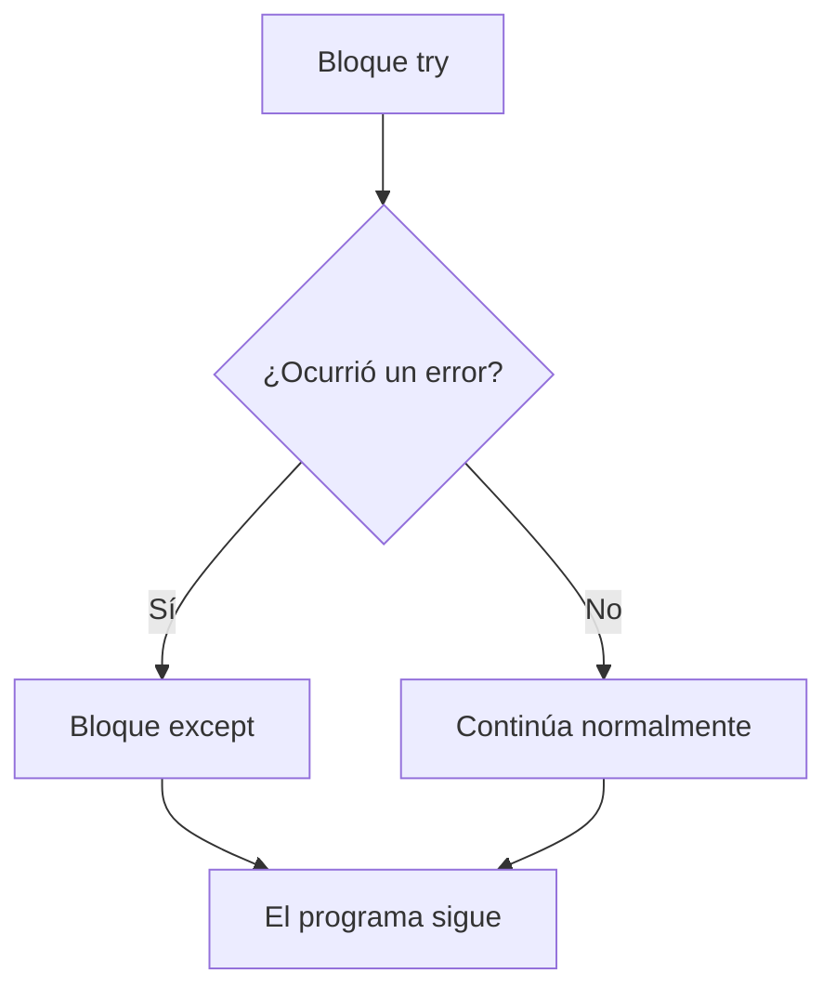
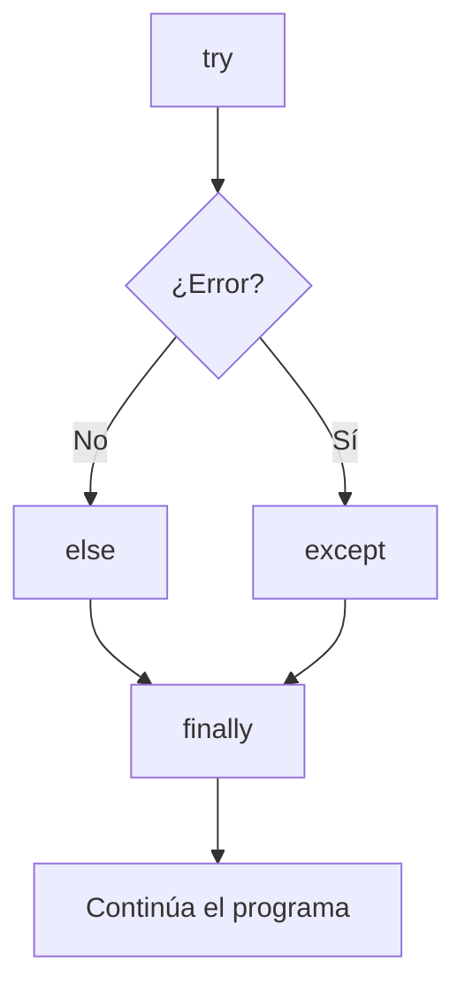

# ⚠️ Manejo de Excepciones en Python

> Cómo capturar y manejar errores para que tu programa no se caiga. Sin complicaciones.

---

## 📋 Índice

1. [¿Qué es una excepción?](#1-qué-es-una-excepción)
2. [try / except — capturar errores](#2-try--except--capturar-errores)
3. [Capturar tipos específicos de error](#3-capturar-tipos-específicos-de-error)
4. [El bloque `else`](#4-el-bloque-else)
5. [El bloque `finally`](#5-el-bloque-finally)
6. [Lanzar excepciones con `raise`](#6-lanzar-excepciones-con-raise)
7. [Excepciones personalizadas](#7-excepciones-personalizadas)
8. [Errores más comunes de Python](#8-errores-más-comunes-de-python)
9. [Resumen rápido](#9-resumen-rápido)

---

## 1. ¿Qué es una excepción?

Una excepción es un **error que ocurre mientras el programa está corriendo**. Si no la capturás, el programa se detiene y muestra un mensaje de error (traceback).

```python
# Este código falla si el usuario escribe "hola" en vez de un número
edad = int(input("¿Cuántos años tenés? "))   # ❌ ValueError si no es número
print(f"En 10 años tendrás {edad + 10}")
```

El manejo de excepciones permite **anticipar esos fallos** y responder de forma controlada.

---

## 2. try / except — capturar errores

```python
try:
    edad = int(input("¿Cuántos años tenés? "))
    print(f"En 10 años tendrás {edad + 10}")
except:
    print("Eso no parece un número válido.")
```



> ⚠️ Usar `except` sin especificar el tipo captura **cualquier error**, incluyendo los que no esperabas. Preferí siempre ser específico (ver sección 3).

---

## 3. Capturar tipos específicos de error

```python
try:
    numero = int(input("Ingresá un número: "))
    resultado = 10 / numero
    print(f"10 / {numero} = {resultado}")

except ValueError:
    print("❌ Eso no es un número entero.")

except ZeroDivisionError:
    print("❌ No se puede dividir por cero.")
```

### Capturar múltiples errores juntos

```python
try:
    valor = int(input("Número: "))
    print(10 / valor)
except (ValueError, ZeroDivisionError) as error:
    print(f"Ocurrió un error: {error}")
```

### Obtener el mensaje del error con `as`

```python
try:
    archivo = open("no_existe.txt")
except FileNotFoundError as e:
    print(f"No se pudo abrir el archivo: {e}")
    # Output: No se pudo abrir el archivo: [Errno 2] No such file or directory: 'no_existe.txt'
```

---

## 4. El bloque `else`

Se ejecuta **solo si no hubo ningún error** en el bloque `try`.

```python
try:
    numero = int(input("Ingresá un número: "))
except ValueError:
    print("❌ Eso no es un número.")
else:
    print(f"✅ Ingresaste el número {numero}")
    print(f"   Su cuadrado es {numero ** 2}")
```

> 💡 `else` es útil para separar el código que "puede fallar" del código que solo debe correr "si todo salió bien".

---

## 5. El bloque `finally`

Se ejecuta **siempre**, haya habido error o no. Ideal para liberar recursos (cerrar archivos, conexiones, etc.).

```python
try:
    archivo = open("datos.txt", "r")
    contenido = archivo.read()
except FileNotFoundError:
    print("El archivo no existe.")
else:
    print(contenido)
finally:
    print("Operación finalizada.")   # se ejecuta siempre
```



### Ejemplo con archivos — patrón completo

```python
archivo = None
try:
    archivo = open("reporte.txt", "r")
    datos = archivo.read()
except FileNotFoundError:
    print("Archivo no encontrado.")
except PermissionError:
    print("Sin permisos para leer el archivo.")
else:
    print(datos)
finally:
    if archivo:
        archivo.close()   # se cierra siempre, incluso si hubo error
```

---

## 6. Lanzar excepciones con `raise`

Podés lanzar un error intencionalmente cuando algo no cumple las condiciones esperadas.

```python
def calcular_promedio(notas):
    if not notas:
        raise ValueError("La lista de notas no puede estar vacía.")
    return sum(notas) / len(notas)

try:
    promedio = calcular_promedio([])
except ValueError as e:
    print(f"Error: {e}")
# Output: Error: La lista de notas no puede estar vacía.
```

### Validar parámetros de entrada

```python
def dividir(a, b):
    if b == 0:
        raise ZeroDivisionError("El divisor no puede ser cero.")
    return a / b

try:
    print(dividir(10, 0))
except ZeroDivisionError as e:
    print(f"Error: {e}")
```

---

## 7. Excepciones personalizadas

Podés crear tus propios tipos de error heredando de `Exception`.

```python
class NotaInvalidaError(Exception):
    """Se lanza cuando una nota está fuera del rango 0-10."""
    pass


class SaldoInsuficienteError(Exception):
    """Se lanza cuando no hay saldo suficiente en la cuenta."""
    def __init__(self, saldo, monto):
        self.saldo = saldo
        self.monto = monto
        super().__init__(f"Saldo insuficiente: tenés ${saldo}, necesitás ${monto}")
```

```python
def registrar_nota(nota):
    if not (0 <= nota <= 10):
        raise NotaInvalidaError(f"La nota {nota} no está en el rango 0-10.")
    return nota

try:
    registrar_nota(15)
except NotaInvalidaError as e:
    print(f"❌ Error: {e}")

# Ejemplo con información extra
try:
    raise SaldoInsuficienteError(saldo=500, monto=800)
except SaldoInsuficienteError as e:
    print(e)   # Saldo insuficiente: tenés $500, necesitás $800
```

---

## 8. Errores más comunes de Python

| Error | Cuándo ocurre | Ejemplo |
|-------|--------------|---------|
| `ValueError` | Valor del tipo correcto pero inválido | `int("hola")` |
| `TypeError` | Operación sobre tipo incorrecto | `"a" + 1` |
| `IndexError` | Índice fuera del rango de una lista | `lista[99]` en lista de 3 |
| `KeyError` | Clave que no existe en un diccionario | `d["x"]` si `"x"` no está |
| `FileNotFoundError` | Abrir archivo que no existe | `open("no_hay.txt")` |
| `ZeroDivisionError` | Dividir por cero | `10 / 0` |
| `AttributeError` | Atributo o método que no existe | `"hola".subir()` |
| `NameError` | Variable usada antes de definirla | `print(x)` sin `x = ...` |
| `ImportError` | Módulo que no existe o no está instalado | `import modulo_inexistente` |
| `RecursionError` | Recursión sin caso base o demasiado profunda | función que se llama sin fin |

### Cómo leer un traceback

```
Traceback (most recent call last):        ← siempre empieza con esto
  File "programa.py", line 5, in <module> ← dónde ocurrió
    resultado = dividir(10, 0)            ← la línea exacta
  File "programa.py", line 2, in dividir
    return a / b
ZeroDivisionError: division by zero       ← tipo de error y mensaje
```

> 💡 Leé el traceback **de abajo hacia arriba**: la última línea es el error, las de arriba te dicen el camino que tomó el código hasta llegar ahí.

---

## 9. Resumen rápido

```python
# Estructura completa
try:
    # código que puede fallar
    resultado = operacion_riesgosa()

except TipoDeError as e:
    # qué hacer si falla
    print(f"Error: {e}")

else:
    # qué hacer si NO falla (opcional)
    usar(resultado)

finally:
    # qué hacer siempre (opcional, para limpiar recursos)
    limpiar()
```

| Bloque | Cuándo se ejecuta |
|--------|------------------|
| `try` | Siempre (es el código principal) |
| `except` | Solo si ocurrió un error en `try` |
| `else` | Solo si NO ocurrió ningún error |
| `finally` | Siempre, pase lo que pase |
