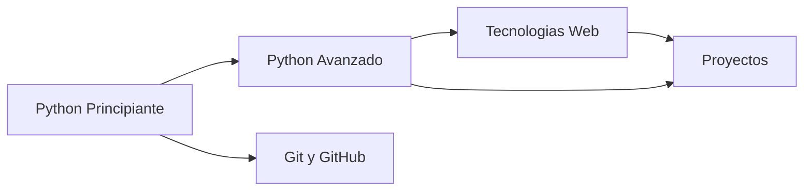

# 🐍 Python Bootcamp

Bienvenido al sitio de apuntes del bootcamp de Python.
Acá encontrarás guías, referencias y ejemplos listos para usar.

---

## ¿Por dónde empezar?

-   :material-school: **Python Principiante**

    ---

    Variables, listas, bucles, funciones y los fundamentos del lenguaje.

    [:octicons-arrow-right-24: Ver guías](fundamentos.md)

-   :material-lightning-bolt: **Python Avanzado**

    ---

    Funciones de alto orden, POO, herencia, encapsulamiento y más.

    [:octicons-arrow-right-24: Ver guías](funciones.md)

-   :material-web: **Tecnologías Web**

    ---

    HTML, CSS, JavaScript, jQuery y Bootstrap para construir páginas web.

    [:octicons-arrow-right-24: Ver guía](web.md)

-   :material-git: **Herramientas del desarrollador**

    ---

    Git y GitHub para versionar tu código y colaborar con otros.

    [:octicons-arrow-right-24: Ver guía](git.md)

---

## Ruta de aprendizaje

---

> 💡 Usá la barra de búsqueda o presioná ++s++ para encontrar cualquier tema rápidamente.

-   :material-git: **Herramientas del desarrollador**

    ---

    Git y GitHub para versionar tu código y colaborar con otros.

    [:octicons-arrow-right-24: Ver guía](git.md)

---

## Ruta de aprendizaje

---

> Usa la barra de busqueda o presiona ++s++ para encontrar cualquier tema rapidamente.
