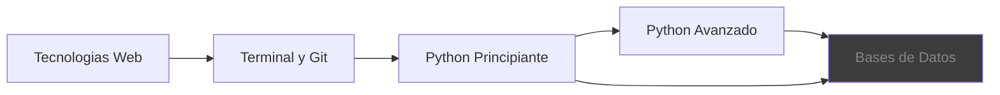

# Python Bootcamp

Sitio de materiales del bootcamp de Python — guías, referencias y ejercicios para el aula.

---

## Contenidos del curso

-   :fontawesome-brands-html5: **Tecnologías Web**

    ---

    HTML, CSS, JavaScript, jQuery y Bootstrap. El punto de partida visual del curso.

    [Ver módulo](web.md)

-   :material-console: **Terminal y Herramientas**

    ---

    Uso de la terminal, comandos esenciales, Git y GitHub para versionar proyectos.

    [Ver módulo](terminal.md)

-   :material-language-python: **Python Principiante**

    ---

    Variables, listas, bucles, archivos y manejo de errores.

    [Ver módulo](fundamentos.md)

-   :material-code-braces: **Python Avanzado**

    ---

    Funciones de alto orden, POO, herencia y encapsulamiento.

    [Ver módulo](funciones.md)

-   :material-database: **Bases de Datos**

    ---

    SQL, SQLite y conexión con Python. Próximamente disponible.

    [Ver módulo](bases-de-datos.md)

-   :material-book-open-variant: **Recursos para el Docente**

    ---

    Plugins, herramientas y configuraciones útiles para preparar clases.

    [Ver recursos](recursos.md)

---

## Ruta de aprendizaje

> Usá la barra de búsqueda o presioná ++s++ para encontrar cualquier tema rápidamente.
