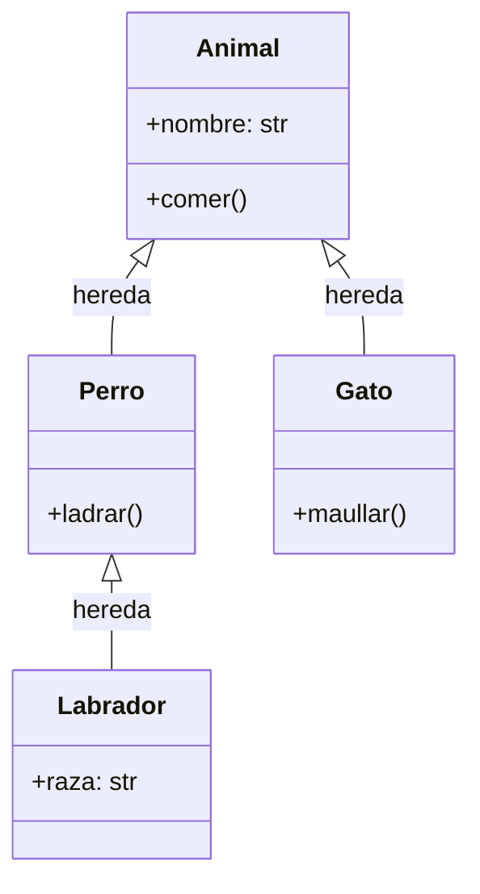

# 🧱 Ayuda Memoria — POO en Python

> Guía rápida de Programación Orientada a Objetos. Sin complicaciones.

---

## 📋 Índice

1. [¿Qué es POO?](#1-qué-es-poo)
2. [Clases y objetos](#2-clases-y-objetos)
3. [El método `__init__`](#3-el-método-__init__)
4. [Atributos y métodos](#4-atributos-y-métodos)
5. [El parámetro `self`](#5-el-parámetro-self)
6. [Herencia](#6-herencia)
7. [Sobreescribir métodos (override)](#7-sobreescribir-métodos-override)
8. [Encapsulamiento](#8-encapsulamiento)
9. [Métodos especiales (dunder methods)](#9-métodos-especiales-dunder-methods)
10. [Errores comunes](#10-errores-comunes)
11. [Resumen rápido](#11-resumen-rápido)

---

## 1. ¿Qué es POO?

POO es una forma de organizar el código usando **objetos** que combinan **datos** (atributos) y **comportamiento** (métodos).

| Concepto | ¿Qué es? | Ejemplo |
|---------|---------|---------|
| **Clase** | El molde / plano de construcción | `Perro` |
| **Objeto** | Una instancia creada desde la clase | `mi_perro = Perro(...)` |
| **Atributo** | Una característica del objeto | `mi_perro.nombre` |
| **Método** | Una acción que puede hacer el objeto | `mi_perro.ladrar()` |

---

## 2. Clases y objetos

```python
# Definir una clase
class Perro:
    pass

# Crear objetos (instancias) de esa clase
fido  = Perro()
toby  = Perro()

print(type(fido))  # <class '__main__.Perro'>
```

> 💡 Por convención los nombres de clases van en `PascalCase` (cada palabra con mayúscula).

---

## 3. El método `__init__`

Es el **constructor**: se ejecuta automáticamente cuando creas un objeto. Ahí defines los atributos iniciales.

```python
class Perro:
    def __init__(self, nombre, raza):
        self.nombre = nombre
        self.raza   = raza

fido = Perro("Fido", "Labrador")
print(fido.nombre)  # Fido
print(fido.raza)    # Labrador
```

---

## 4. Atributos y métodos

### Atributos — los datos del objeto

```python
class Persona:
    def __init__(self, nombre, edad):
        self.nombre = nombre   # atributo de instancia
        self.edad   = edad

p = Persona("Ana", 30)
print(p.nombre)   # Ana
p.edad = 31       # puedes modificarlos
print(p.edad)     # 31
```

### Métodos — las acciones del objeto

```python
class Persona:
    def __init__(self, nombre, edad):
        self.nombre = nombre
        self.edad   = edad

    def saludar(self):
        print(f"Hola, soy {self.nombre} y tengo {self.edad} años")

    def cumpleanos(self):
        self.edad += 1
        print(f"¡Feliz cumpleaños {self.nombre}! Ahora tienes {self.edad}")

p = Persona("Luis", 25)
p.saludar()      # Hola, soy Luis y tengo 25 años
p.cumpleanos()   # ¡Feliz cumpleaños Luis! Ahora tienes 26
```

### Atributos de clase (compartidos por todos)

```python
class Perro:
    especie = "Canis lupus familiaris"   # atributo de clase

    def __init__(self, nombre):
        self.nombre = nombre

fido = Perro("Fido")
toby = Perro("Toby")

print(fido.especie)  # Canis lupus familiaris
print(toby.especie)  # Canis lupus familiaris
print(Perro.especie) # también se accede desde la clase
```

---

## 5. El parámetro `self`

`self` representa **el objeto mismo**. Siempre es el primer parámetro de los métodos de instancia (Python lo pasa automáticamente).

```python
class Calculadora:
    def __init__(self, valor):
        self.valor = valor

    def sumar(self, n):
        self.valor += n    # modifica el atributo del objeto
        return self.valor

calc = Calculadora(10)
calc.sumar(5)   # Python llama a sumar(calc, 5) por debajo
print(calc.valor)  # 15
```

> 💡 El nombre `self` es solo una convención, podrías llamarlo de otra forma, pero **nunca lo hagas**.

---

## 6. Herencia

Permite crear una clase **nueva basada en una existente**, reutilizando su código.



```python
# Clase padre (base)
class Animal:
    def __init__(self, nombre):
        self.nombre = nombre

    def comer(self):
        print(f"{self.nombre} está comiendo")

# Clase hija hereda de Animal
class Perro(Animal):
    def ladrar(self):
        print(f"{self.nombre} dice: ¡Guau!")

class Gato(Animal):
    def maullar(self):
        print(f"{self.nombre} dice: ¡Miau!")

fido  = Perro("Fido")
michi = Gato("Michi")

fido.comer()    # Fido está comiendo    ← heredado de Animal
fido.ladrar()   # Fido dice: ¡Guau!    ← propio de Perro

michi.comer()   # Michi está comiendo  ← heredado de Animal
michi.maullar() # Michi dice: ¡Miau!  ← propio de Gato
```

### `super()` — llamar al constructor del padre

```python
class Animal:
    def __init__(self, nombre):
        self.nombre = nombre

class Perro(Animal):
    def __init__(self, nombre, raza):
        super().__init__(nombre)   # llama al __init__ de Animal
        self.raza = raza

fido = Perro("Fido", "Labrador")
print(fido.nombre)  # Fido
print(fido.raza)    # Labrador
```

---

## 7. Sobreescribir métodos (override)

La clase hija puede **redefinir un método del padre** para cambiar su comportamiento.

```python
class Animal:
    def hablar(self):
        print("...")

class Perro(Animal):
    def hablar(self):          # override
        print("¡Guau!")

class Gato(Animal):
    def hablar(self):          # override
        print("¡Miau!")

animales = [Perro(), Gato(), Animal()]
for a in animales:
    a.hablar()
# ¡Guau!
# ¡Miau!
# ...
```

---

## 8. Encapsulamiento

Controla qué atributos y métodos son accesibles desde fuera de la clase.

| Convención | Significado | Ejemplo |
|-----------|-------------|---------|
| `nombre` | Público — accesible desde cualquier lugar | `self.nombre` |
| `_nombre` | Protegido — señal de "no tocar directamente" | `self._saldo` |
| `__nombre` | Privado — Python cambia el nombre para dificultar el acceso | `self.__password` |

```python
class CuentaBancaria:
    def __init__(self, titular, saldo):
        self.titular  = titular      # público
        self._saldo   = saldo        # protegido (convencion)
        self.__pin    = "1234"       # privado (name mangling)

    def mostrar_saldo(self):
        print(f"Saldo: ${self._saldo}")

    def depositar(self, monto):
        if monto > 0:
            self._saldo += monto

cuenta = CuentaBancaria("Ana", 100000)
cuenta.mostrar_saldo()        # Saldo: $100000
cuenta.depositar(50000)
cuenta.mostrar_saldo()        # Saldo: $150000

print(cuenta.titular)         # Ana         ✅
print(cuenta._saldo)          # 150000      ⚠️ funciona pero no es buena práctica
# print(cuenta.__pin)         # ❌ AttributeError
print(cuenta._CuentaBancaria__pin)  # 1234  (name mangling, no hacer esto)
```

---

## 9. Métodos especiales (dunder methods)

Son métodos con doble guion bajo al inicio y al final (`__método__`). Python los llama automáticamente en ciertas situaciones.

```python
class Producto:
    def __init__(self, nombre, precio):
        self.nombre = nombre
        self.precio = precio

    def __str__(self):
        # qué se muestra con print(objeto)
        return f"{self.nombre} — ${self.precio}"

    def __repr__(self):
        # representación técnica del objeto
        return f"Producto('{self.nombre}', {self.precio})"

    def __eq__(self, otro):
        # qué pasa cuando usas ==
        return self.precio == otro.precio

    def __lt__(self, otro):
        # qué pasa cuando usas <
        return self.precio < otro.precio

p1 = Producto("Café", 2500)
p2 = Producto("Té",   2500)
p3 = Producto("Agua", 1000)

print(p1)          # Café — $2500
print(p1 == p2)    # True  (mismo precio)
print(p1 > p3)     # True
```

### Los más usados

| Método | Se invoca cuando... |
|--------|-------------------|
| `__init__` | Se crea el objeto (`Clase()`) |
| `__str__` | Se usa `print(objeto)` o `str(objeto)` |
| `__repr__` | Se ve el objeto en la consola o `repr(objeto)` |
| `__len__` | Se usa `len(objeto)` |
| `__eq__` | Se usa `objeto1 == objeto2` |
| `__lt__` | Se usa `objeto1 < objeto2` |
| `__add__` | Se usa `objeto1 + objeto2` |

---

## 10. Errores comunes

| Error | Causa | Solución |
|-------|-------|----------|
| `TypeError: __init__() takes X arguments` | Pasaste más o menos argumentos al crear el objeto | Revisa los parámetros del `__init__` |
| `AttributeError: object has no attribute 'x'` | Intentas acceder a un atributo que no existe | Verifica que esté definido en `__init__` |
| `TypeError: método() takes 1 positional argument but 2 were given` | Te olvidaste el `self` en la definición del método | Agrega `self` como primer parámetro |
| `NameError` al acceder a atributo desde un método | Usaste `nombre` en vez de `self.nombre` | Siempre usar `self.` para atributos de la instancia |

```python
# ❌ Error clásico: olvidar self
class Persona:
    def __init__(self, nombre):
        self.nombre = nombre

    def saludar():             # falta self
        print(self.nombre)

# ✅ Correcto
class Persona:
    def __init__(self, nombre):
        self.nombre = nombre

    def saludar(self):         # ✅
        print(self.nombre)
```

---

## 11. Resumen rápido

```python
# Definir una clase
class MiClase:
    atributo_clase = "compartido"          # atributo de clase

    def __init__(self, valor):
        self.valor = valor                 # atributo de instancia

    def metodo(self):                      # método de instancia
        return self.valor

    def __str__(self):                     # representación en texto
        return f"MiClase({self.valor})"

# Herencia
class Hija(MiClase):
    def __init__(self, valor, extra):
        super().__init__(valor)            # llama al padre
        self.extra = extra

    def metodo(self):                      # override
        return f"{super().metodo()} + {self.extra}"

# Crear objetos
obj   = MiClase(42)
hija  = Hija(10, "bonus")

print(obj)           # MiClase(42)
print(obj.valor)     # 42
print(hija.metodo()) # 10 + bonus
```

| Concepto | Sintaxis |
|---------|---------|
| Definir clase | `class Nombre:` |
| Constructor | `def __init__(self, ...):` |
| Atributo | `self.atributo = valor` |
| Método | `def metodo(self):` |
| Herencia | `class Hija(Padre):` |
| Llamar al padre | `super().__init__(...)` |
| Override | Redefinir el método en la hija |
| `__str__` | `def __str__(self): return "..."` |
| Instanciar | `obj = MiClase(args)` |
| Acceder atributo | `obj.atributo` |
| Llamar método | `obj.metodo()` |
