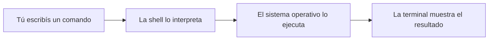
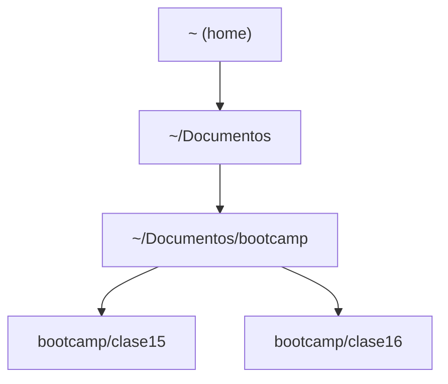
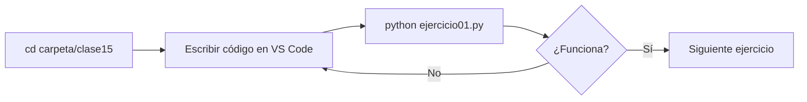
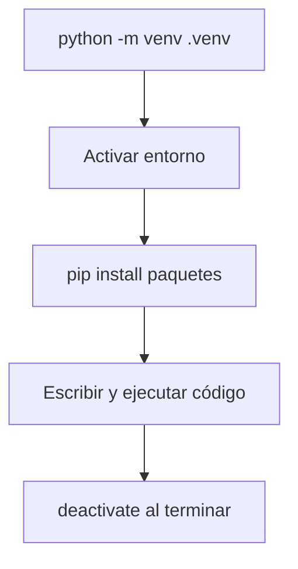

# :material-console: La Terminal

> Cómo usar la terminal para navegar, ejecutar código y trabajar como desarrollador.

---

## 📋 Índice

1. [¿Qué es la terminal?](#1-qué-es-la-terminal)
2. [Navegar entre carpetas](#2-navegar-entre-carpetas)
3. [Crear, mover y eliminar archivos](#3-crear-mover-y-eliminar-archivos)
4. [Ejecutar scripts Python](#4-ejecutar-scripts-python)
5. [Variables de entorno y PATH](#5-variables-de-entorno-y-path)
6. [Entornos virtuales](#6-entornos-virtuales)
7. [Errores comunes](#7-errores-comunes)
8. [Resumen de comandos](#8-resumen-de-comandos)

---

## 1. ¿Qué es la terminal?

La terminal (también llamada consola, shell o línea de comandos) es una interfaz de texto para interactuar directamente con el sistema operativo.



| Plataforma | Terminal |
|-----------|---------|
| macOS / Linux | Terminal, zsh, bash |
| Windows | PowerShell, CMD, Git Bash |
| VS Code | Terminal integrada (cualquiera de las anteriores) |

> 💡 Durante el curso usamos la **terminal integrada de VS Code**. Se abre con ++ctrl+grave++ (acento grave).

---

## 2. Navegar entre carpetas

=== "macOS / Linux"

    ```bash
    pwd                    # muestra la carpeta actual (Print Working Directory)
    ls                     # lista archivos y carpetas
    ls -la                 # lista con detalles y archivos ocultos
    cd carpeta             # entra a una carpeta
    cd ..                  # sube un nivel
    cd ~                   # va al directorio home
    cd /ruta/absoluta      # va a una ruta exacta
    ```

=== "Windows (PowerShell)"

    ```powershell
    Get-Location           # muestra la carpeta actual (o pwd como alias)
    Get-ChildItem          # lista archivos (o ls como alias)
    Set-Location carpeta   # entra a una carpeta (o cd como alias)
    cd ..                  # sube un nivel
    cd ~                   # va al directorio home
    ```

### Navegación visual



```bash
# Para llegar a clase15 desde home:
cd Documentos/bootcamp/clase15

# Para subir dos niveles:
cd ../..
```

---

## 3. Crear, mover y eliminar archivos

=== "macOS / Linux"

    ```bash
    mkdir nueva-carpeta          # crea una carpeta
    mkdir -p carpeta/sub/sub2    # crea carpetas anidadas
    touch archivo.txt            # crea un archivo vacío
    mv origen destino            # mueve o renombra
    cp origen destino            # copia
    rm archivo.txt               # elimina un archivo
    rm -rf carpeta/              # elimina una carpeta y todo su contenido
    ```

=== "Windows (PowerShell)"

    ```powershell
    New-Item -ItemType Directory -Name nueva-carpeta
    New-Item archivo.txt -ItemType File
    Move-Item origen destino     # mueve o renombra
    Copy-Item origen destino     # copia
    Remove-Item archivo.txt      # elimina
    Remove-Item carpeta -Recurse # elimina carpeta y contenido
    ```

> ⚠️ `rm -rf` y `Remove-Item -Recurse` son **irreversibles**. No hay papelera de reciclaje.

---

## 4. Ejecutar scripts Python

```bash
# Versión instalada de Python
python --version
python3 --version     # en macOS/Linux puede ser necesario

# Ejecutar un script
python mi_script.py
python3 mi_script.py

# Ejecutar con argumentos (sys.argv)
python mi_script.py Juan 25

# Modo interactivo (REPL)
python
>>> print("Hola")
>>> exit()
```

### Flujo típico de clase



---

## 5. Variables de entorno y PATH

El **PATH** es la lista de carpetas donde el sistema busca los programas cuando escribís un comando.

```bash
# Ver el PATH
echo $PATH             # macOS/Linux
echo $env:PATH         # PowerShell

# Ver el Python que está usando el sistema
which python           # macOS/Linux
Get-Command python     # PowerShell
```

Si escribís `python` y dice "comando no encontrado", probablemente Python no está en el PATH.

---

## 6. Entornos virtuales

Un entorno virtual aísla las librerías de un proyecto para que no interfieran con otros.

```bash
# Crear el entorno
python -m venv .venv

# Activar
source .venv/bin/activate      # macOS/Linux
.venv\Scripts\Activate.ps1     # PowerShell

# Instalar librerías
pip install requests numpy

# Guardar dependencias
pip freeze > requirements.txt

# Instalar desde requirements
pip install -r requirements.txt

# Desactivar
deactivate
```



> 💡 Siempre activá el entorno virtual antes de instalar librerías o ejecutar código del proyecto.

---

## 7. Errores comunes

### "python: command not found"

```bash
# Intentar con python3
python3 mi_script.py

# O verificar instalación
where python        # Windows
which python3       # macOS/Linux
```

### "No module named X"

```bash
# El módulo no está instalado en el entorno activo
pip install nombre-del-modulo

# Verificar qué entorno está activo
which python         # macOS/Linux
Get-Command python   # PowerShell
```

### "Permission denied" al activar venv en Windows

```powershell
Set-ExecutionPolicy -Scope Process -ExecutionPolicy RemoteSigned
.venv\Scripts\Activate.ps1
```

---

## 8. Resumen de comandos

| Acción | macOS/Linux | Windows (PowerShell) |
|--------|------------|---------------------|
| Ver carpeta actual | `pwd` | `pwd` |
| Listar contenido | `ls` | `ls` |
| Entrar a carpeta | `cd nombre` | `cd nombre` |
| Subir un nivel | `cd ..` | `cd ..` |
| Crear carpeta | `mkdir nombre` | `mkdir nombre` |
| Crear archivo | `touch archivo.txt` | `New-Item archivo.txt` |
| Eliminar archivo | `rm archivo.txt` | `Remove-Item archivo.txt` |
| Ejecutar Python | `python3 script.py` | `python script.py` |
| Activar venv | `source .venv/bin/activate` | `.venv\Scripts\Activate.ps1` |
| Instalar paquete | `pip install X` | `pip install X` |
